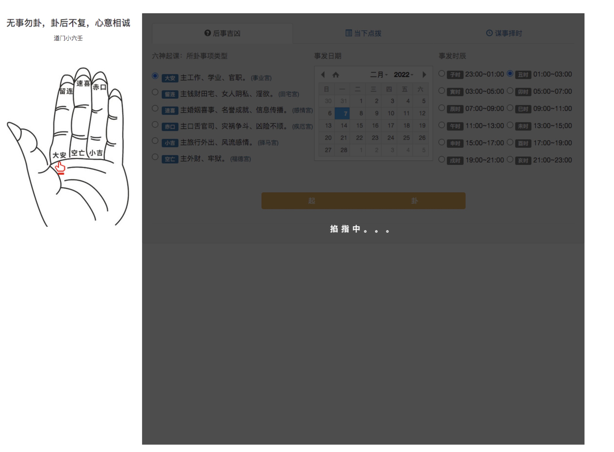
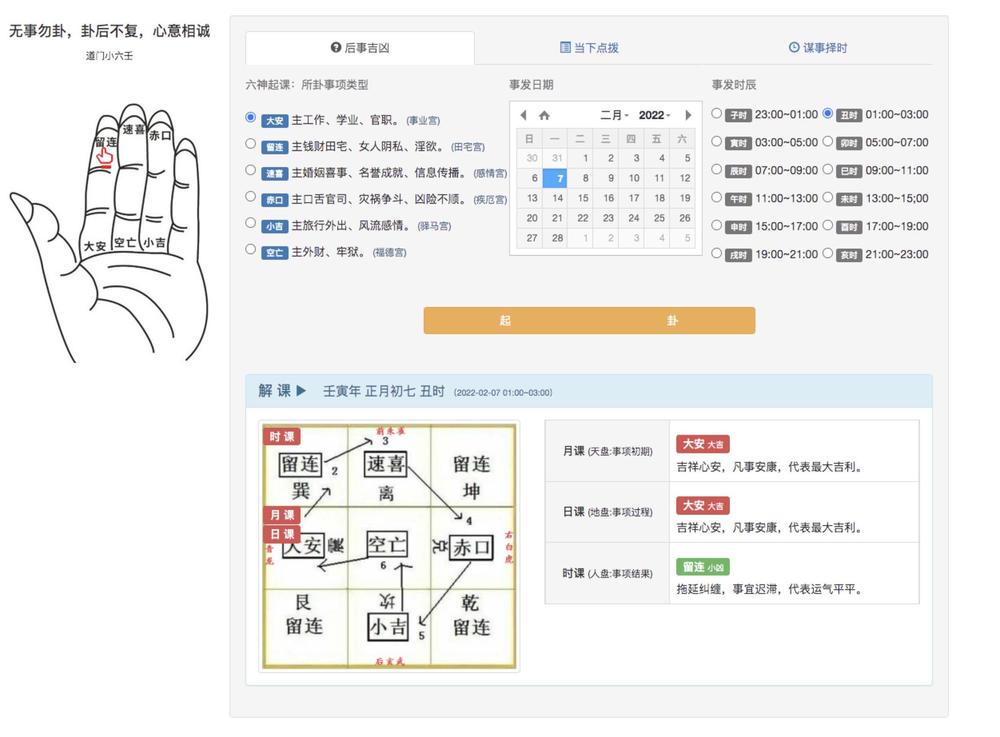
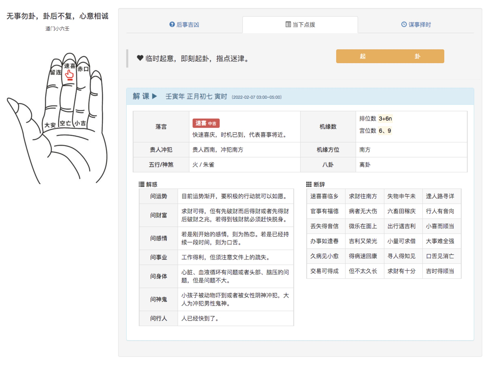
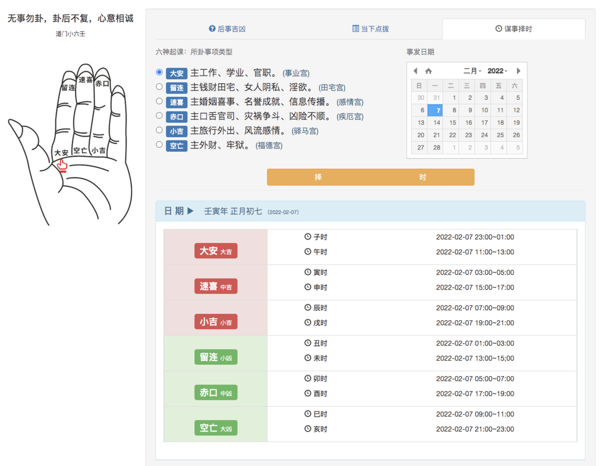

> 基于 Gin 框架实现道门小六壬

### Quick Start
```bash
docker run -d --rm -p 8000:8000 maifusha/xiaoliuren
curl -L localhost:8000
```

### Screen Shots





### Specification
网传小六壬法本较多，这里对起课做特别约定，未来时间明确的事项依据具体类型配合歌诀起课(后事吉凶)，临时起意时间不定的事项从大安起课(当下点拨)